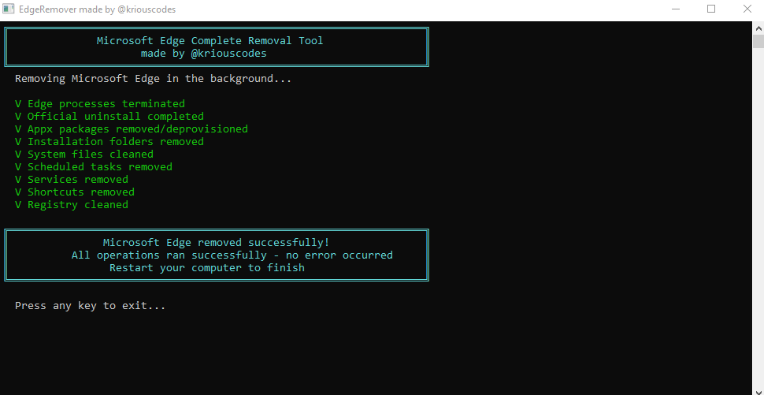
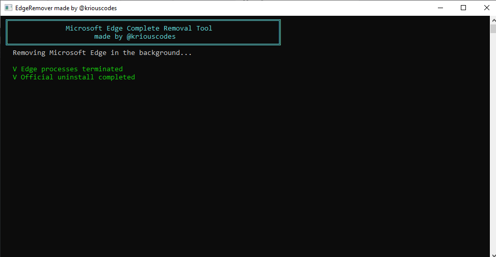

# EdgeRemover

**A professional, silent Microsoft Edge removal tool for Windows**  
Built in C# – Fast, clean, and user-friendly.

 <!-- Optional banner – replace with your own -->

## Features
- **Automatic UAC Elevation** – Double-click and approve once
- **Beautiful Console UI** – Cyan borders, green success indicators, yellow warnings
- **Completely Silent Operations** – No flashing PowerShell windows
- **Thorough Cleanup** – Files, folders, registry, services, tasks, shortcuts, Appx packages
- **Optional WebView2 Removal** – Use `--webview` flag
- **Open Source & Transparent** – Full C# source code included

## Screenshots

  
*Professional console interface with progress feedback*

  
*Clean completion message*

## Download
Latest stable release:  
[**EdgeRemover v1.0.0**](https://github.com/KriousCodes/EdgeRemover/releases/latest)

## How to Use
1. Download `EdgeRemover.exe` from the Releases section.
2. Double-click the file → Click **Yes** on the UAC prompt (admin rights required).
3. The tool runs silently in the background.
4. Restart your computer when prompted.

**Advanced**: To also remove Microsoft Edge WebView2 (used by some apps):  
Open Command Prompt as administrator and run:  
`EdgeRemover.exe --webview`

## Disclaimer
⚠️ **Use at your own risk.**  
Removing Microsoft Edge may affect certain Windows features or applications that depend on it (e.g., Widgets, some Office apps).  
Always test on a virtual machine first.  
You can reinstall Edge anytime from [microsoft.com/edge](https://www.microsoft.com/edge).

## Contributing
Contributions are welcome! Feel free to:
- Open issues for bugs or suggestions
- Submit pull requests

## License
This project is licensed under the **MIT License** – see the [LICENSE](LICENSE) file for details.

---

Made with ❤️ by [@kriouscodes](https://github.com/kriouscodes)  
⭐ Star this repo if you found it useful!
